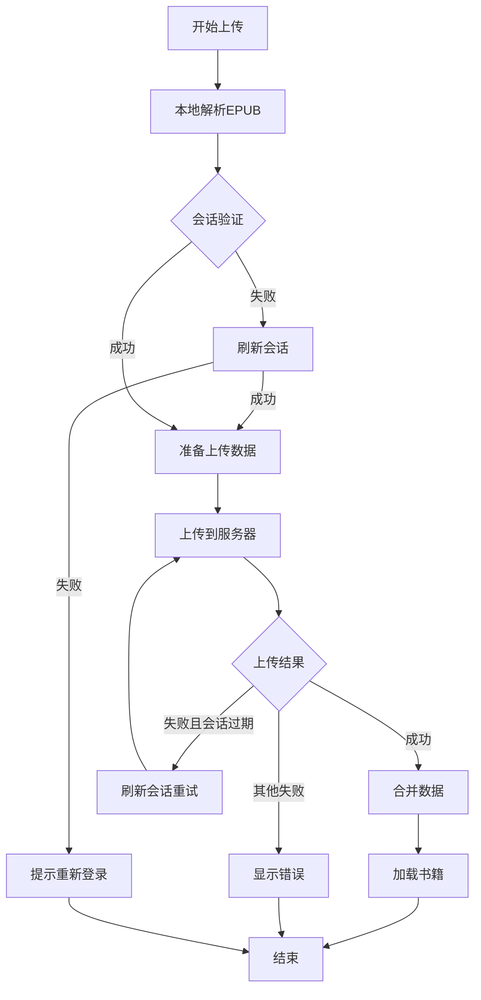
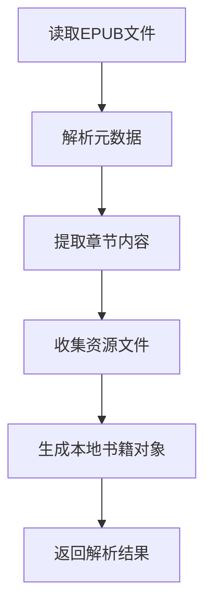
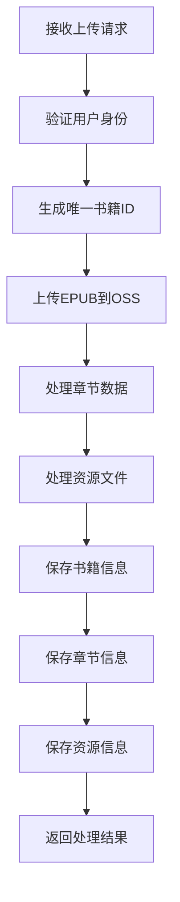
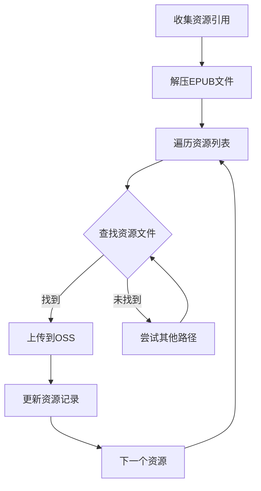
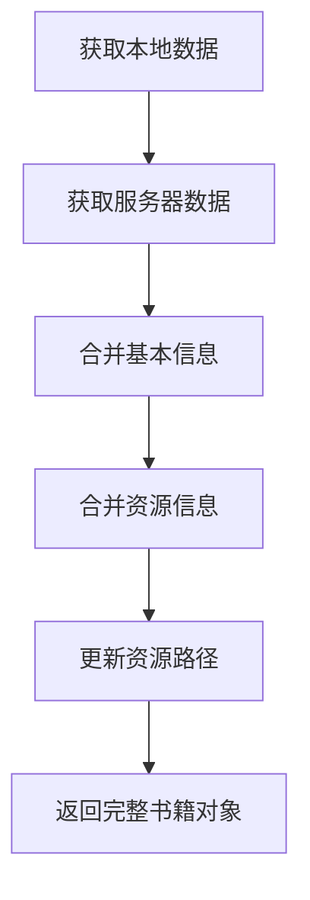

## 书籍上传流程说明

### 整体流程图

### 本地解析EPUB流程

### 服务器处理流程

### 资源处理流程

### 数据合并流程

## 关键步骤说明

1. **本地解析**
   - 解析EPUB文件获取基本信息
   - 提取章节内容和资源引用
   - 生成本地书籍对象

2. **会话管理**
   - 验证当前会话
   - 必要时刷新会话
   - 处理认证错误

3. **资源处理**
   - 收集所有资源引用
   - 处理图片等媒体文件
   - 上传到OSS存储
   - 记录资源映射关系

4. **数据存储**
   - 保存书籍基本信息
   - 保存章节内容
   - 保存资源记录
   - 建立关联关系

5. **错误处理**
   - 会话过期处理
   - 上传失败重试
   - 资源处理异常
   - 数据存储错误

## 注意事项

1. 资源路径处理
   - 支持多种可能的路径格式
   - 处理EPUB中的相对路径
   - 确保资源正确映射

2. 数据完整性
   - 使用事务确保数据一致性
   - 保持资源引用的完整性
   - 确保关联关系正确

3. 性能优化
   - 批量处理资源上传
   - 优化数据库操作
   - 合理使用缓存

4. 安全性
   - 严格的用户认证
   - 文件类型验证
   - 资源访问控制 