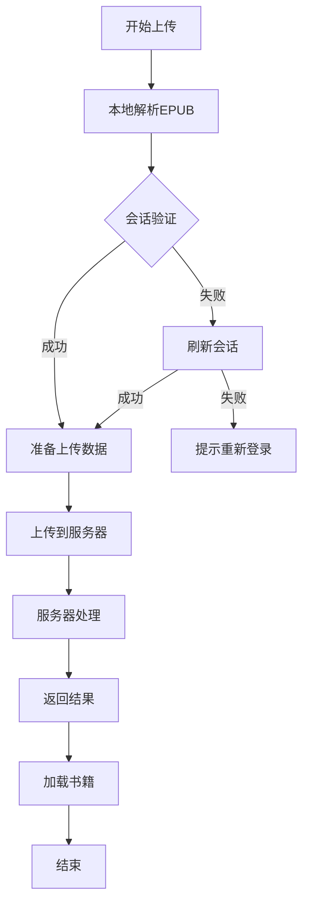
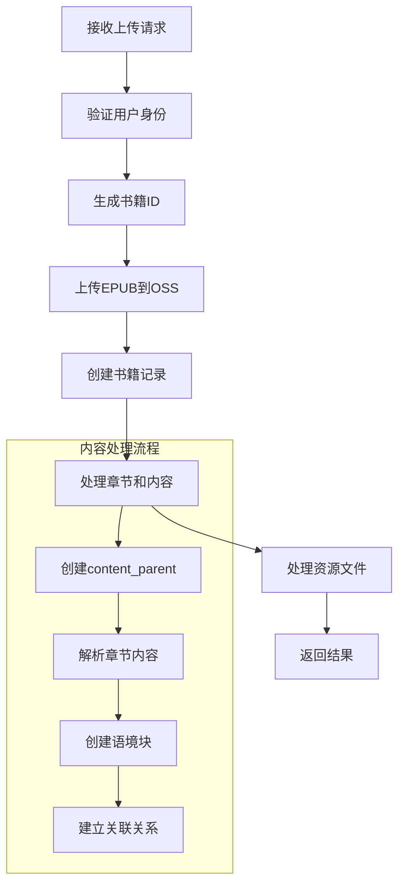
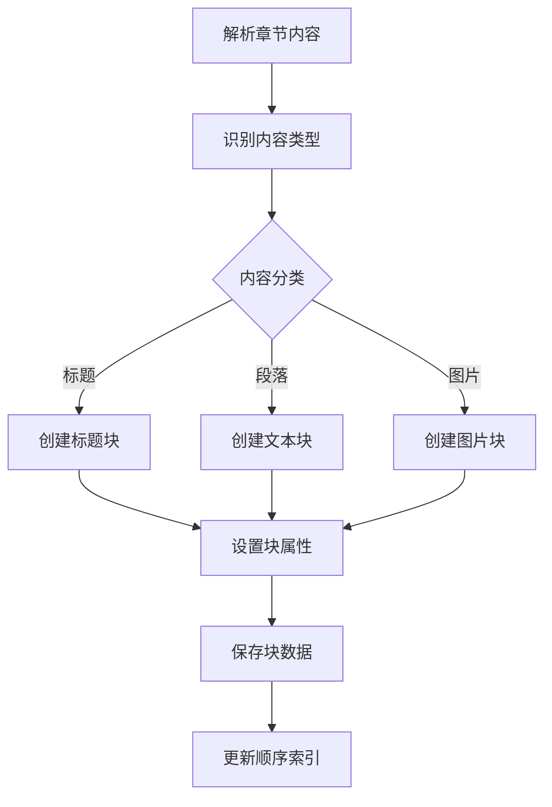
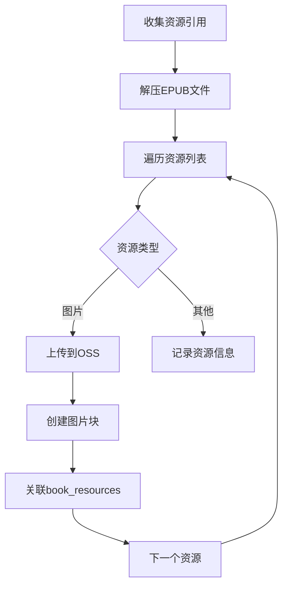
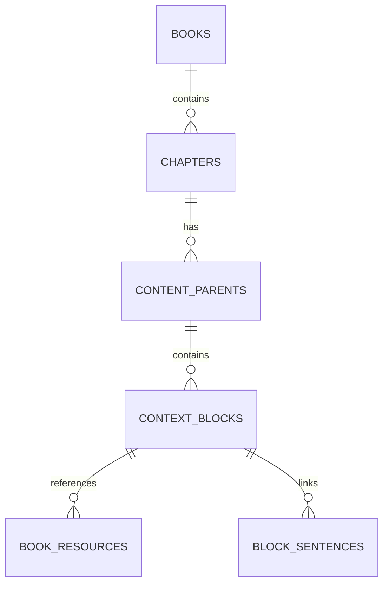

## 基于语境块的新版书籍上传流程

### 整体流程图



### 服务器处理主流程



### 语境块创建流程



### 资源处理流程



## 详细步骤说明

1. **初始化处理**
   - 验证用户身份
   - 生成唯一书籍ID
   - 创建基础目录结构

2. **创建基础记录**
   ```sql
   -- 创建书籍记录
   INSERT INTO books (...) VALUES (...);
   
   -- 为每个章节创建content_parent
   INSERT INTO content_parents (
     content_type,
     title,
     user_id,
     metadata
   ) VALUES ('chapter', chapter.title, user.id, chapter.metadata);
   ```

3. **内容块处理**
   ```sql
   -- 创建各类型的语境块
   INSERT INTO context_blocks (
     parent_id,
     block_type,
     content,
     order_index,
     metadata
   ) VALUES (...);
   ```

4. **资源处理**
   ```sql
   -- 创建资源记录
   INSERT INTO book_resources (
     book_id,
     original_path,
     oss_path,
     resource_type,
     mime_type,
     context_block_id
   ) VALUES (...);
   ```

## 数据结构关系



## 关键改进点

1. **模块化内容管理**
   - 章节内容被拆分为多个语境块
   - 每个块都有明确的类型和属性
   - 支持灵活的内容组织

2. **资源关联优化**
   - 资源直接关联到具体的语境块
   - 支持多种类型的资源引用
   - 更精确的资源管理

3. **内容结构升级**
   - 支持更丰富的内容类型
   - 便于后续功能扩展
   - 更好的内容复用

4. **数据完整性**
   - 完整的父子关系链
   - 清晰的数据关联
   - 事务性操作保证

## 注意事项

1. **内容解析**
   - 正确识别内容类型
   - 保持块顺序
   - 处理特殊字符

2. **资源处理**
   - 确保资源完整性
   - 处理路径映射
   - 优化上传性能

3. **数据迁移**
   - 兼容旧数据结构
   - 平滑升级策略
   - 数据验证机制

4. **性能优化**
   - 批量创建操作
   - 索引优化
   - 并发处理

## 后续扩展

1. **音视频对齐**
   - 支持音频文本对齐
   - 视频内容集成
   - 时间轴管理

2. **内容编辑**
   - 块级编辑功能
   - 拖拽排序支持
   - 实时保存能力

3. **版本控制**
   - 块级别的版本管理
   - 内容变更追踪
   - 回滚机制 